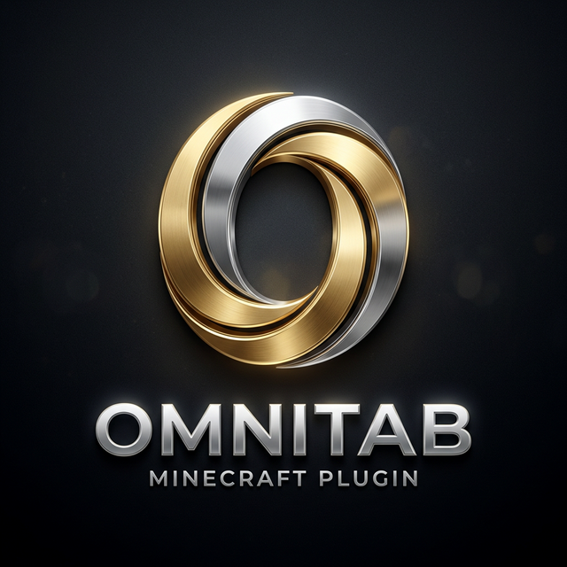

# OmniTab: The Elite Universal Tablist System



OmniTab is a high-performance, universal tablist solution for Minecraft servers (Spigot, Paper, and derivatives). It provides a professional, "elite" architecture designed to support versions from **1.8.8 to 1.21.x** using a single, optimized JAR file.

## Core Features

- **Universal Version Support**: Seamlessly supports 1.8.8 through 1.21.x without needing version-specific builds.
- **Elite Styling & Gradients**: Support for dynamic RGB gradients and Hex colors (`<#RRGGBB>`) with intelligent legacy fallback for older clients.
- **Staff Stealth & Vanish**: Integrated vanish detection with automated packet-level hide/show logic to protect staff privacy.
- **Asynchronous Engine**: All string processing and animation ticking occurs off the main thread to ensure zero impact on server TPS.
- **Smart Sorting Architecture**: Permission-based sorting hierarchy with weights ensures players appear exactly where they should.
- **Placeholder Integration**: Extensive internal placeholders plus full integration with PlaceholderAPI.

## Installation

1. Download the latest release from the [GitHub Releases](https://github.com/GamingOP69/OmniTab/releases) page.
2. Place the `omnitab-core-1.0.0.jar` into your server's `plugins` directory.
3. Restart or start your server.
4. Customize your experience in `plugins/OmniTab/config.yml`.

## Commands & Permissions

- `/omnitab reload` (Alias: `/ot reload`): Reloads all configurations, animations, and services.
  - Permission: `omnitab.admin`

## Developer API

OmniTab offers a clean API for developers to extend its functionality or query tablist states.

```java
// Accessing the main instance
OmniTab plugin = OmniTab.getInstance();

// Interacting with the Tablist Handler
TablistHandler handler = plugin.getTablistHandler();
```

## Security & Performance

OmniTab follows industry-standard security practices:
- **Packet Sanitization**: All tablist packets are sanitized to prevent client-side exploits.
- **Dirty Checking**: Packets are only dispatched when state changes occur, minimizing network overhead.
- **Memory Safety**: Automated cache evacuation for disconnected players prevent memory leaks.

## License

OmniTab is released under the [MIT License](LICENSE).

---
*Developed and Maintained by GamingOP. Professional. Reliable. Elite.*
